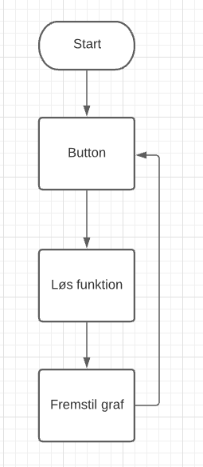
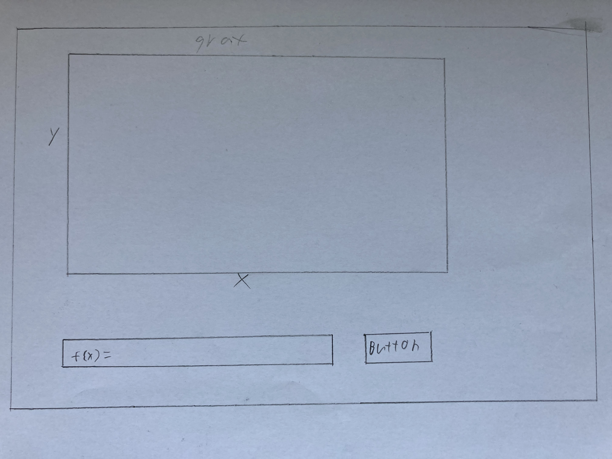
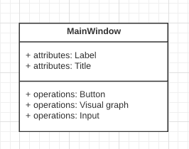
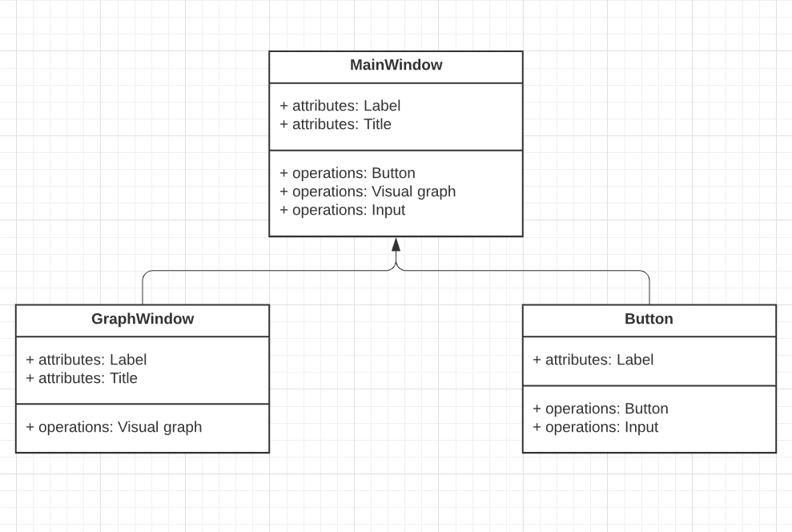

# data-visualization
Trello link: https://trello.com/b/hwHV8EyE/gooey-stuff-2

Kode inspiration: https://www.geeksforgeeks.org/how-to-embed-matplotlib-charts-in-tkinter-gui/

Her er det første flowchart

Her er den først GUI skitsen

Her er første version af vores UML diagram. Det skal siges at alt fra flowchart, uml og skitser opdateres løbende jo længere ind i projektet vi kommer 

