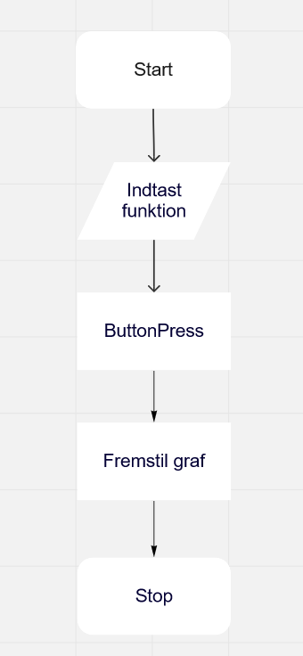

# data-visualization
Trello link: https://trello.com/b/hwHV8EyE/gooey-stuff-2

Kode inspiration: https://www.geeksforgeeks.org/how-to-embed-matplotlib-charts-in-tkinter-gui/

Her er det første flowchart

Her er et opdateret flowchart. Som nok lagt mærke til, har vi nu et bruger input felt som vi ikke havde i det første. Ellers er der ikke som sådan noget der har ændret sig siden det første flowchart. 

Her er den først GUI skitsen

Her er første version af vores UML diagram.

Her er version 2 af vores UML diagram. 

Vi stødte ind i det sjove, hvor vores kode har ændret sig så meget, at det første UML diagram passer mere til vores endelige kode end det andet UML diagram. Det var ret tilfældigt at det skete, og det skyldes primært af, vi indså vi havde overkompliceret koden en del.  
